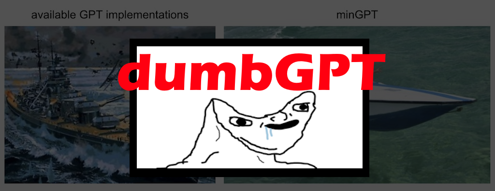

# dumbGPT

If you tried to watch Karpathy's 2h GPT video and thought, "I need something simpler, I dont even understand this. Why is everything so difficult?", this is the repo for you.

## How to use this repo
- `main.py` has a full walkthrough from data processing until model inference Start from there.
- `inputs` directory contains 27 .txt files with 100 observations each,and we assume all those observations come from the same distribution. We want to train our model to be able to learn these sequences
- `src\dumbGPT.py` is the simplest implementation of a GPT model from [Karpathy's mingpt implementation](https://github.com/karpathy/minGPT)
- `tokenizer.py` is a simple float tokenizer for our specific use case